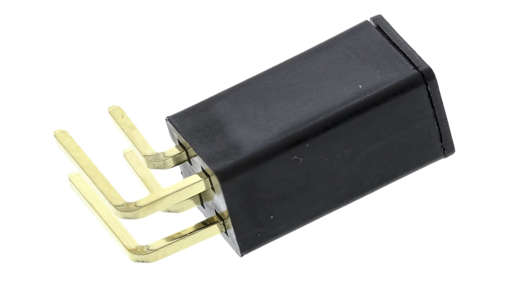
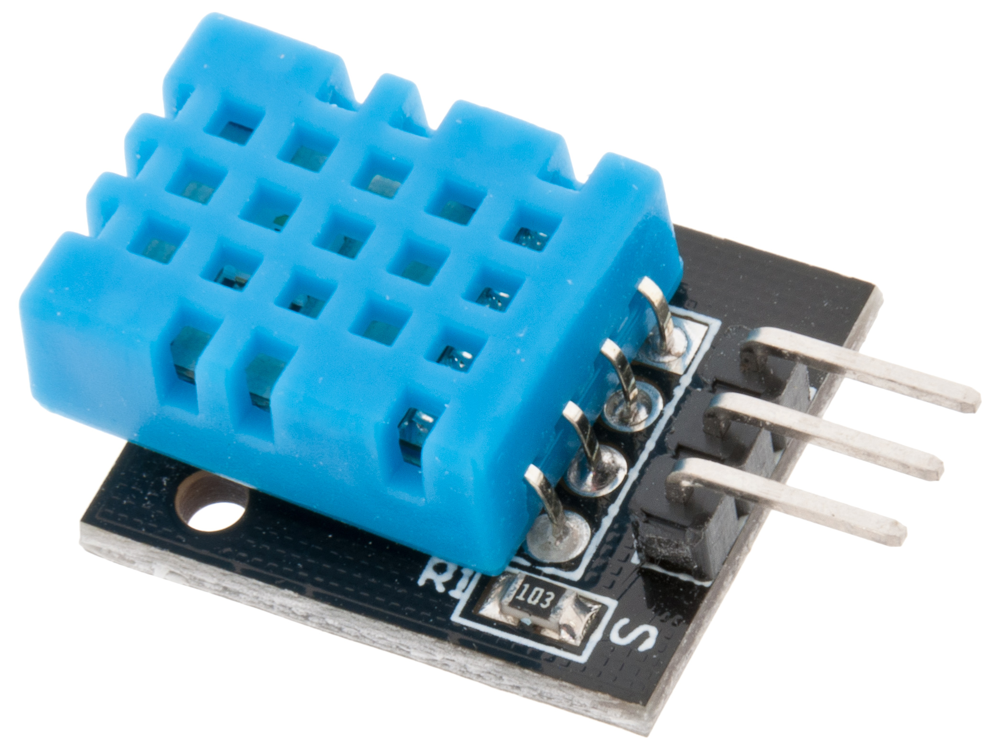
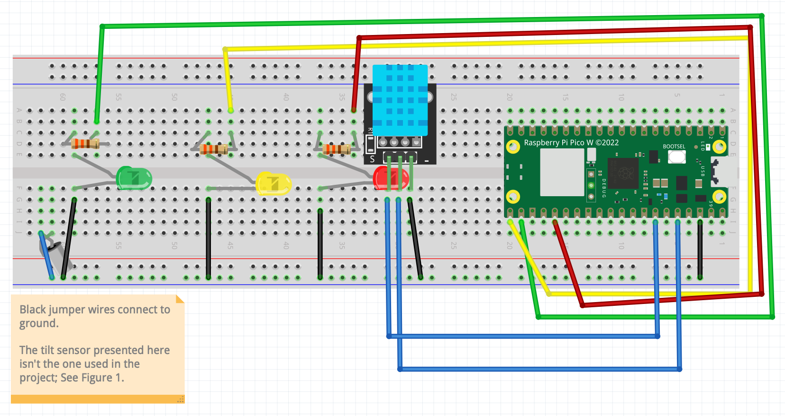
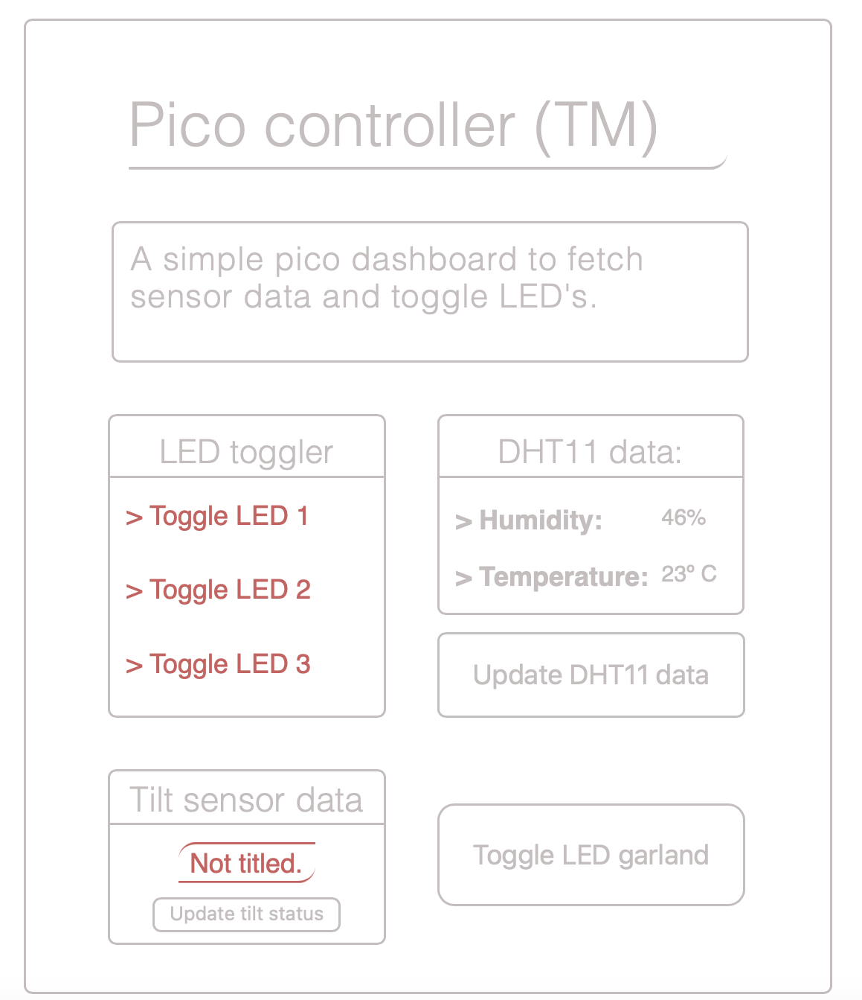
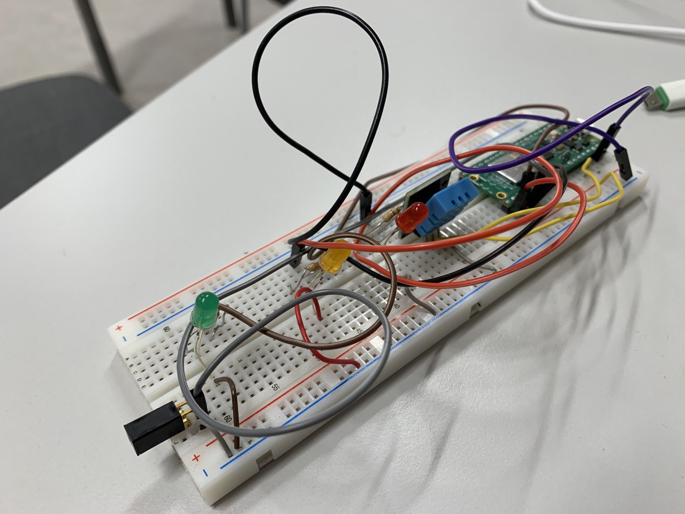

# PHP webpage as a pico dashboard
### Rodions Busurovs, rb222yr
## Project Overview

The project, as the name implies, was an attempt at building a webpage to serve as a dashboard for interacting with the pico and its connected components.

The technologies used were PHP for backend functionality and pico communication, JavaScript for basic UI design and animation, as well as AJAX requests, and, finally, Micropython for scripting pico-related functionality.

## Time

Building this application took approximately 25-35 hours, around 5-6 hours a day. Given that this was the first time I had to work with the majority of technologies used, replicating this project would take a considerably shorter amount of time for a more experienced IoT developer.

## Objective

I had chosen to build this project as it was an opportunity to become accustomed with not only IoT, but also PHP - this language, as well as Micropython and Internet of Things as a whole were brand new to me, and I had no prior experience working with any of the listed tools.

## Purpose

The project's primary purpose is establishing a socket connection between the PHP server and the Raspberry Pi Pico WH. With this functionality complete, an unlimited number of sensors can be further added onto the pico, presenting an opportunity to create a flexible online dashboard for wirelessly reading sensor data.

## Insights

The project provides new insights as to how server and API infrastructure interacts, and has given me sufficient experience to further develop similar, more complex applications. It demonstrates the strengths, as well as shortcomings of PHP as a backend development language, but also serves as a simplified example of how IoT devices wirelessly exchange data between servers and each other.

## Material


| Component     | Purpose       |
| ------------- | ------------- |
| 1x red LED    | Testing whether the socket  |
| 1x green LED  | connection has been established,  |
| 1x yellow LED | as well as a secondary "christmas lights" feature|
| 1x Assemtech 15° Horizontal Tilt Switch 25mA, 24V | Sending data based on the breadboard's angle (tilted/not tilted) |
| 1x DHT11 temperature and humidity sensor | Sending temperature and humidity data to the server |
| 3x 330ohm 0.25W Carbon Film Resistor | Connecting LED's to their respective GPIO pins and managing electrical output |
| 11x jumper wires | Grounding components, connecting them to GPIO pins |
| 1x Raspberry Pi Pico WH | Reading data from sensors, activating LED's, supplying power to components, sending data to the local server via the micropython script's socket connection |

The choice of components was based on the contents of the Electrokit package provided by the course. The total cost SEK 448, shipping included, although the individual component price is unknown.

Nevertheless, both the tilt sensor (fig. 2) and DHT11 (fig. 2) were great tools for a beginner to work with, presenting data in a straightforward fashion, while also both being relatively cheap and replaceable.

Pictures provided below:

<div style="display: flex; justify-content: space-evenly;">
  <div>
    
    <p style="font-style: italic;">Figure 1, tilt sensor used in the project</p>
  </div>
  <div>
    
    <p style="font-style: italic;">Figure 2, the specific DHT-11</p>
  </div>
</div>

## Computer setup

Visual Studio Code was used throughout the entirety of the project's development, as it was the IDE I was most accustomed to. Thonny IDE, while being a popular tool for Micropython development, was uncomfortable to work in.

### Flashing the firmware

Firmware required for Micropython to work on Raspberry Pi Pico WH was acquired via Raspberry Pi Foundation's website, <a href="https://projects.raspberrypi.org/en/projects/get-started-pico-w/1">here</a>.

Installing the micropython file required connecting the pico as a USB storage device, by holding the BOOTSEL button on the Raspberry Pi itself. Then the file had to be transferred there manually, upon which the USB device disconnected itself automatically, being a sign that the installation was successful. 

### VSC extensions

Pico-W-Go (now known simply as MicroPico) by paulober.dev had to be installed in order to work with the Pico via Visual Studio Code. The extension provided the following tools:

- Pico connection status display;
- Pico file management: transferring files from or onto the Pico and deleting the currently uploaded files;
- Running the currently opened Micropython file on the connected Pico.

Pico-W-Go was therefore used to upload code to the Pico.

### PHP

PHP did not require any further installations, as work was conducted on a macbook that features a prebundled version of the language. Working on Windows may require an additional PHP installation. Further information can be found <a href="https://www.php.net/manual/en/install.windows.php">here</a>.

### MAMP 

MAMP was used as free software for setting up a MySQL local server. phpMyAdmin was used as an interface for managing the data and its installation guide and bundle can be found <a href="https://www.mamp.info/en/downloads/">here</a>.

## Putting everything together

Below is a circuit diagram to demonstrate how the project was set up:



While the setup is more than functional for development, it is recommended to manually determine which resistors are necessary for every LED. The ones used in the project were chosen due to lack of any other type.

The DHT-11 sensor was connected following the tutorial provided by the course staff on hackmd (link unavailable), as the pinout found online (Fig. 3) did not match this particular DHT-11, and almost caused it to burn. It is therefore strongly recommended to be careful when connecting this sensor and to preferrably try to follow the circuit diagram's pinout.


*Figure 3. DHT-11 likely pinout, not guaranteed.*

## Platform

It could be said that the project's "platform" was the M1 macbook itself where its development took place. The PHP server, as well as mySQL were both hosted locally, turned on and off when necessary. MAMP was the application used for hosting phpMyAdmin and mySQL, so the development platform involved multiple local installations. 

When it comes to scaling up the project, it would be a great idea to provide the hosting for both the database and the webpage using an older, no longer needed computer. 

It is unlikely for the project to become so resource-intensive that it would require more than a single server hosted on, for instance, an old macbook, but it would be necessary to ensure that the internet connection is stable - over the course of the application's development, only a personal hotspot as well as home Wi-Fi were used for data transfer.

## The Code

### Establishing a socket connection

The following two pieces of code are snippets of how a socket connection is established, in PHP:

```php
  // If a post request has been submitted from index.php
  if(isset($_POST)) {
    $data = file_get_contents("php://input");

    // decode the JSON data sent from index.php
    $decodedData = json_decode($data, true);
    
    // create the socket
    $socket = socket_create(AF_INET, SOCK_STREAM, SOL_TCP);

    // IP address must be changed based on wifi network
    // can be checked on mac using bash command "ipconfig getifaddr en0"
    $result = socket_connect($socket, '172.20.10.10', 8001);

    if ($result === false) {
      echo "Failed to connect to the server: " . socket_strerror(socket_last_error()) . "\n";
      exit;
    }
  // ... more stuff ...
  }
```
...And in Micropython (Including connecting to the Wi-Fi network):

```python
  ssid = 'wifi_name'
  password = 'wifi_password'
  wlan.connect(ssid, password)
  
  # essentially the same thing as in php
  sock = usocket.socket(usocket.AF_INET, usocket.SOCK_STREAM)
  try:
    # connecting to the socket, same ip, same host
    sock.bind(('172.20.10.10', 8001))
  except OSError as e:
    print(e)
  # listening for requests
  sock.listen(1)
```

### Sending data via FETCH requests

Below are some JS examples of fetch POST requests being sent to server.php, to be processed and sent to the Pico, as JSON files:

```JavaScript
    // e - event, activated via button press?
    // remember to prevent default (page reload)
    const fetchSensorData = (e) => {
      // id is dht/tilt, i.e. identifiers for different actions
      const id = e.target.id
      const data = {
          type: id
        }
      
      // submitting a fetch request
      // sending a json object with the id
      fetch('http://localhost:8000/src/php/server.php',  {
        method: 'POST',
        headers: {
          'Content-Type': 'application/json; charset=utf-8'
        },
        body: JSON.stringify(data)
      })
      // awaiting a response, and getting the data back
      .then(res => res.json())
      .then(data => {
        console.log(data)
        
        // id is dht, then display temperature and humidity
        // id is tilted, then display if it's tilted or not
        if (id == "dht") {
          hum.textContent = data["humidity"]
          temp.textContent = data["temperature"]
        } else {
          tilt.textContent = data["tilted"]
        }
      })
    }
```

### Database interaction

The project saves sensor data to the sensor_data SQL database every time a response from a sensor is caught, therefore make sure to have that database created on your local mySQL server like this:

```sql 
 CREATE DATABASE sensor_data;
 /* or */
 CREATE SCHEMA sensor_data;

```

The file *db.php* is responsible for connecting to the database and creating the two sensor tables if they don't exist. The file isn't large, so it is not necessary to provide any code snippets here.

This is how *server.php* saves data to the database:

```php

        if ($decodedData["type"] == "dht") {
          $temperature = $php_data->temperature;
          $humidity = $php_data->humidity;

          $sql = "INSERT INTO dht_data (temperature, humidity) 
                  VALUES ('$temperature', '$humidity')";

        } else if ($decodedData["type"] == "tilt") {
          $tilted = $php_data->tilted;
          $sql = "INSERT INTO tilt_data (tilted) 
              VALUES (" . ($tilted == "Tilted!" ? "1" : "0") . ")";
      
      }
      // if sql variable is not null
      // if couldn't submit query
      if (isset($sql)) {
        if ($conn->query($sql) === FALSE) {
          echo "Error: " . $sql . "<br>" . $conn->error;
        }
        $conn->close();
      }

```

The rest of the codebase is relatively easy to comprehend, especially the micropython files. Of note is that two helper classes had been written to better deal with LED's and the DHT sensor.

## Transmitting the data and connectivity

There is no fixed interval between data transfers. Data is sent via the socket to the Pico and back to the PHP server once the user selects an action, such as to update the temperature and humidity data. 

The wireless protocol used in the app was Wi-Fi, as mentioned earlier. The connection is established via the creation of a socket as seen in the code snippets above.

Data is transferred between the server and the Pico the following way:

1. User selects an action, and a post request is triggered
2. JSON object is submitted to *server.php*, where the data is processed.
3. The JSON data is sent further to the Pico.
4. If the user had chosen to update sensor data or toggle the festive lights mode, server.php and JS fetch requests await a "reply" from the Pico. Festive lights mode additionally requires the cycle count parameter.
5. Once a reply is received, only sensor data is inserted into the database by *server.php*.

The TCP wireless protocol was used to establish a socket in PHP, as seen in one of the code samples provided in the previous section.

While TCP is known to transfer data at a much slower pace compared to other, more recent protocols, it is generally considered reliable, taking its time to perform a "handshake" between a sender and a receiver before sending the data.  

## Presenting the data

Currently, there is no mechanism implemented to purge old data from the database. This, however, can be relatively easy to implement in PHP, erasing any data older than a certain period of time - both tables feature a datetime column.

There is no fixed interval for saving data received from sensors. It simply gets inserted into its respective table upon being caught by the server, and the latest reading is then loaded from the database when the page is reloaded.

MySQL, being a reliable and widely-used relational database, was the first choice that came to mind when designing the application. Having over a year of experience working with MySQL, it also happened to be the easiest option, and considering the small size of data actually being saved by the application, there was no practical need to look for a more complex or less well-known alternative.

User interactions on the dashboard outlined in the previous section, such as button presses, can be considered the "data triggers" in the context of this application.

Picture of the dashboard below:



## Final thoughts

Overall, I would say that I had achieved my original goals over the course of the project's development - to make an interactive "online" dashboard that can interact with the sensors of a remote Pico. 

It was a great decision to attempt to connect a PHP server to a Micropython application, gaining experience in working with both technologies at once. The dashboard, seen above, was designed with simple CSS/JS animations in mind, which, while not related to IoT, was a practical and engaging way to refine this skill as well.

The only subject that, I believe, still needs a lot of work, is my cable management skill :) (Fig.4)



*Figure 4. Did that pretty circuit diagram manage to fool you?*


